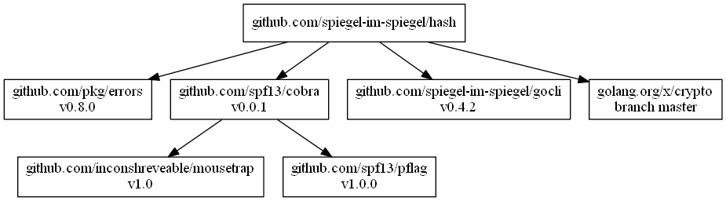

# hash -- Calculating Hash Value

[](https://raw.githubusercontent.com/spiegel-im-spiegel/hash/master/LICENSE)

## Install

```
$ go get github.com/spiegel-im-spiegel/hash
```

Installing by [dep].

```
$ dep ensure -add github.com/spiegel-im-spiegel/hash
```

## Usage

```go
v, err := hash.Value(bytes.NewBuffer([]byte("")), crypto.SHA1)
if err != nil {
    return
}
fmt.Printf("%x\n", v)
// Output:
// da39a3ee5e6b4b0d3255bfef95601890afd80709
```

```go
v, err := hash.ValueFromBytes([]byte(""), crypto.SHA1)
if err != nil {
    return
}
fmt.Printf("%x\n", v)
// Output:
// da39a3ee5e6b4b0d3255bfef95601890afd80709
```

### Required hash function packages

| hash algorithm | import package |
|:---------------|:---------------|
| `crypto.MD4`         | `golang.org/x/crypto/md4` |
| `crypto.MD5`         | `crypto/md5` |
| `crypto.SHA1`        | `crypto/sha1` |
| `crypto.SHA224`      | `crypto/sha256` |
| `crypto.SHA256`      | `crypto/sha256` |
| `crypto.SHA384`      | `crypto/sha512` |
| `crypto.SHA512`      | `crypto/sha512` |
| `crypto.SHA512_224`  | `crypto/sha512` |
| `crypto.SHA512_256`  | `crypto/sha512` |
| `crypto.RIPEMD160`   | `golang.org/x/crypto/ripemd160` |
| `crypto.SHA3_224`    | `golang.org/x/crypto/sha3` |
| `crypto.SHA3_256`    | `golang.org/x/crypto/sha3` |
| `crypto.SHA3_384`    | `golang.org/x/crypto/sha3` |
| `crypto.SHA3_512`    | `golang.org/x/crypto/sha3` |
| `crypto.BLAKE2s_256` | `golang.org/x/crypto/blake2s` |
| `crypto.BLAKE2b_256` | `golang.org/x/crypto/blake2b` |
| `crypto.BLAKE2b_384` | `golang.org/x/crypto/blake2b` |
| `crypto.BLAKE2b_512` | `golang.org/x/crypto/blake2b` |

```go
package main

import (
	_ "crypto/md5"
	_ "crypto/sha1"
	_ "crypto/sha256"
	_ "crypto/sha512"

	_ "golang.org/x/crypto/blake2b"
	_ "golang.org/x/crypto/blake2s"
	_ "golang.org/x/crypto/md4"
	_ "golang.org/x/crypto/ripemd160"
	_ "golang.org/x/crypto/sha3"
)
```


## Command Line Interface

```
$ hash -h
Usage:
  hash [flags] [binary file]

Flags:
  -a, --algo string      hash algorithm (default "sha256")
  -c, --compare string   compare hash value
  -h, --help             help for hash
```

```
$ cat empty.txt | hash -a sha1
da39a3ee5e6b4b0d3255bfef95601890afd80709
```

```
$  hash -a sha1 empty.txt
da39a3ee5e6b4b0d3255bfef95601890afd80709
```


```
$  hash -a sha1 empty.txt -c da39a3ee5e6b4b0d3255bfef95601890afd80709
matched
```

### Hash Algorithms

`md4`, `md5`, `sha1`, `sha224`, `sha256`, `sha384`, `sha512`, `sha512/224`, `sha512/256`, `ripemd160`, `sha3-224`, `sha3-256`, `sha3-384`, `sha3-512`, `blake2s`, `blake2b/256`, `blake2b/384`, `blake2b/512`

### Dependencies (CLI only)

```
dep status -dot | dot -Tpng -o dependency.png
```

[](dependency.png)


[hash]: https://github.com/spiegel-im-spiegel/hash "spiegel-im-spiegel/hash: Calculating Hash Value"
[dep]: https://github.com/golang/dep "golang/dep: Go dependency management tool"
