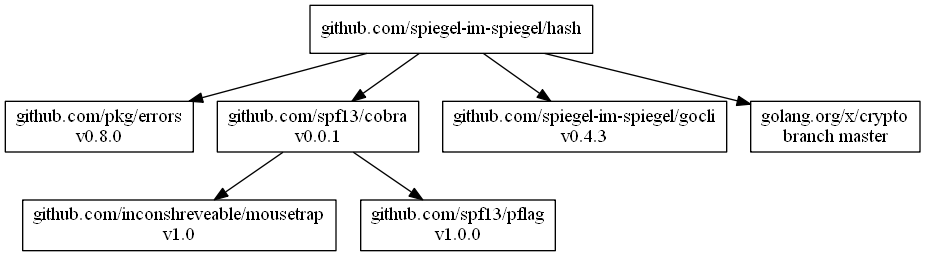

# hash -- Calculating Hash Value

## Install

```
$ go get github.com/spiegel-im-spiegel/hash
```

## Usage

```
$ hash -h
Usage:
  hash [flags] [binary file]

Flags:
  -a, --algo string      hash algorithm (default "sha256")
  -c, --compare string   compare hash value
  -h, --help             help for hash
  -l, --list             listing hash functions
```

```
$ cat empty.txt | hash -a sha1
da39a3ee5e6b4b0d3255bfef95601890afd80709
```

```
$ hash -a sha1 empty.txt
da39a3ee5e6b4b0d3255bfef95601890afd80709
```


```
$ hash -a sha1 empty.txt -c da39a3ee5e6b4b0d3255bfef95601890afd80709
matched
```

## Hash Algorithms

`md4`, `md5`, `sha1`, `sha224`, `sha256`, `sha384`, `sha512`, `sha512/224`, `sha512/256`, `ripemd160`, `sha3-224`, `sha3-256`, `sha3-384`, `sha3-512`, `blake2s`, `blake2b/256`, `blake2b/384`, `blake2b/512`

```
$ hash -l
Available hash algorithms: md4 md5 sha1 sha224 sha256 sha384 sha512 sha512/224 sha512/256 ripemd160 sha3-224 sha3-256 sha3-384 sha3-512 blake2s blake2b/256 blake2b/384 blake2b/512
```

### Dependencies

```
dep status -dot | dot -Tpng -o dependency.png
```

[](dependency.png)


[hash]: https://github.com/spiegel-im-spiegel/hash "spiegel-im-spiegel/hash: Calculating Hash Value"
[dep]: https://github.com/golang/dep "golang/dep: Go dependency management tool"
